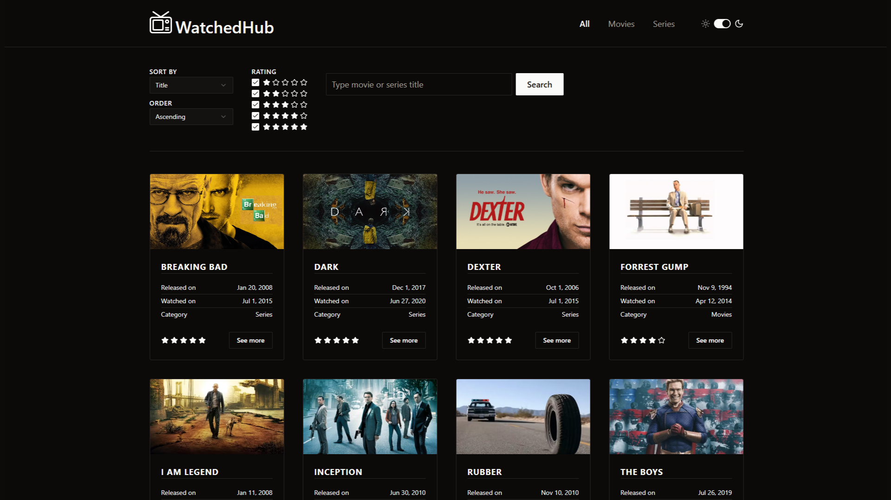

# Watched Hub

See the live version of [Watched Hub](https://bartoszdudziak-dev.github.io/watched-hub/).

Project created as part of an individual frontend mentoring program.

I integrated a Headless CMS, enabling me to personally add and manage content, which can then be dynamically searched using a combination of filters.

**Main features**:

- 🔍 Advanced Search (Powered by Prismic CMS)
- 💾 Data Caching
- 🌗 Dark & Light Theme
- 📱 Responsive Design

&nbsp;

## 💡 Technologies

&nbsp;

## 👏 Special thanks

Thanks to my [Mentor - devmentor.pl](https://devmentor.pl/) – for providing me with this task and for code review.
